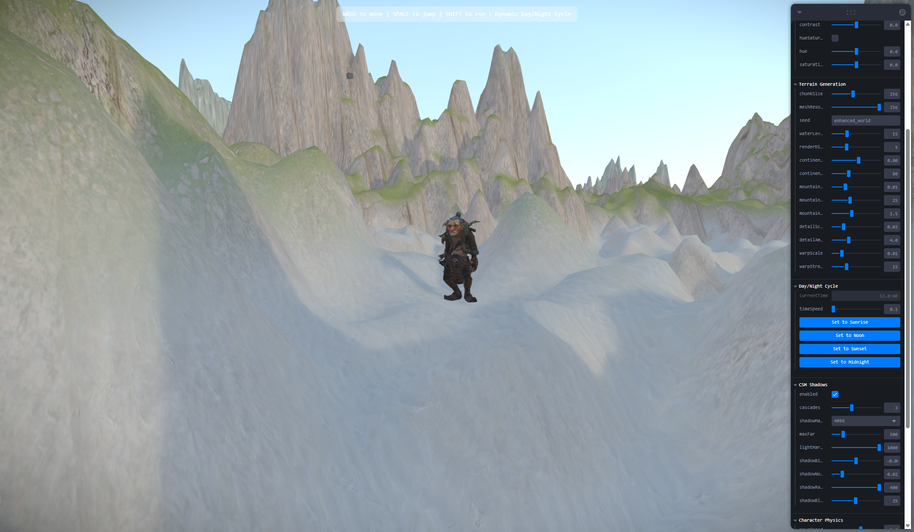

# r3f-infinite-character-controller

A fully interactive 3D character controller and infinite procedural world built with React Three Fiber, Rapier physics, and advanced rendering techniques.  
Includes robust mobile controls, day/night cycle, cascaded shadow mapping, and a powerful terrain system.  
**Play it live or use as a starter for your own 3D web worlds!**

---

## Features

- **Infinite Procedural World**: Seamless, endless terrain with biome blending, mountains, valleys, and more.
- **3D Character Controller**: Responsive third-person controls (WASD, jump, sprint, camera orbit).
- **Mobile Support**: Touch joystick and jump button for mobile browsers.
- **Physics Engine**: Realistic collisions, jumping, and movement using [Rapier](https://rapier.rs/).
- **Cascaded Shadow Mapping**: High-quality, large-scale shadows with CSM (toggleable).
- **Dynamic Day/Night Cycle**: Fantasy-inspired atmospheric lighting, sky, and environment.
- **Post-processing**: Bloom, vignette, chromatic aberration, depth of field, and color grading.
- **Leva Debug UI**: Tweak terrain, character, camera, lighting, and visual effects live.
- **Modular Codebase**: Well-structured, extensible, and easy to customize.
- **Cross-platform**: Works on desktop and mobile browsers.

---

## Live Demo

[**Try the demo →**](https://character-sample-project.netlify.app/)

---

## Getting Started

### Prerequisites

- **Node.js** v16 or newer (recommended: latest LTS)
- **npm** or **yarn**

### Installation

´´´
git clone https://github.com/yourusername/r3f-infinite-character-controller.git
cd r3f-infinite-character-controller
npm install
´´´

### Running the App

´´´
npm run dev
´´´

Open [http://localhost:5173](http://localhost:5173) to view it in your browser.

---

## Usage

### Desktop Controls

- **WASD / Arrow Keys**: Move character
- **Space**: Jump
- **Shift**: Sprint
- **Right Mouse Drag**: Orbit camera
- **Mouse Wheel / Pinch**: Zoom camera

### Mobile Controls

- **Joystick (bottom left)**: Move character
- **Jump Button (bottom right)**: Jump

---

## Customization

### Terrain & World

- **Leva panel** (top-left, desktop): Tweak chunk size, mesh resolution, seed, water level, render distance, mountain/valley/detail/warp parameters, etc.
- Terrain regenerates instantly and the character is robustly repositioned on the new ground.

### Character

- Adjust movement speed, jump force, air control, friction, damping, and more.
- Physics settings are live-editable via Leva.

### Camera

- Orbit, zoom, and pitch controls.
- Camera settings editable via Leva.

### Shadows

- Toggle between classic directional shadows and CSM.
- Adjust shadow quality, cascades, bias, and blur.

### Visual Effects

- Enable/disable and fine-tune bloom, vignette, chromatic aberration, depth of field, brightness/contrast, hue/saturation.

### Day/Night

- Adjust time speed and instantly set time to sunrise, noon, sunset, or midnight.

---

## Project Structure

´´´
/src
  /components         # 3D scene, character, sky, environment, mobile controls
  /camera             # Camera system
  /contexts           # React contexts (mobile controls, camera, day/night, etc)
  /hooks              # Custom hooks for controls, effects, and UI
  /world              # Infinite world system, chunk manager, terrain generation
  /utils              # Device detection, physics helpers
  App.tsx             # Main application
  main.tsx            # Entry point
/public
  /models             # 3D models (GLB)
  /textures           # Terrain textures
  screenshot.png      # Project screenshot
´´´

---

## Tech Stack

- **React** + **TypeScript**
- **[React Three Fiber](https://github.com/pmndrs/react-three-fiber)** (Three.js in React)
- **[Rapier](https://rapier.rs/)** (Physics)
- **[Leva](https://github.com/pmndrs/leva)** (Live controls)
- **[Tailwind CSS](https://tailwindcss.com/)** (Styling)
- **[Vite](https://vitejs.dev/)** (Build tool)
- **[@react-three/drei, @react-three/postprocessing, @react-three/rapier]** (R3F ecosystem)
- **Custom shaders** for sky, environment, and terrain blending

---

## Deployment

The app is ready to be deployed on [Netlify](https://www.netlify.com/), [Vercel](https://vercel.com/), or any static hosting.

´´´
npm run build
´´´

Then deploy the `dist` folder.

---

## Acknowledgements

- [pmndrs](https://github.com/pmndrs) for the R3F ecosystem
- [Rapier Physics](https://rapier.rs/)
- [Leva](https://leva.pmnd.rs/)
- [Three.js](https://threejs.org/)
- [Simplex-noise](https://github.com/jwagner/simplex-noise.js)
- [alea](https://github.com/coverslide/node-alea) for reproducible random

---

## License

MIT

---

## Contributing

Pull requests and issues are welcome! Please open an issue for questions, bugs, or feature requests.

---

## Screenshot

---

**Enjoy building infinite worlds!**

---